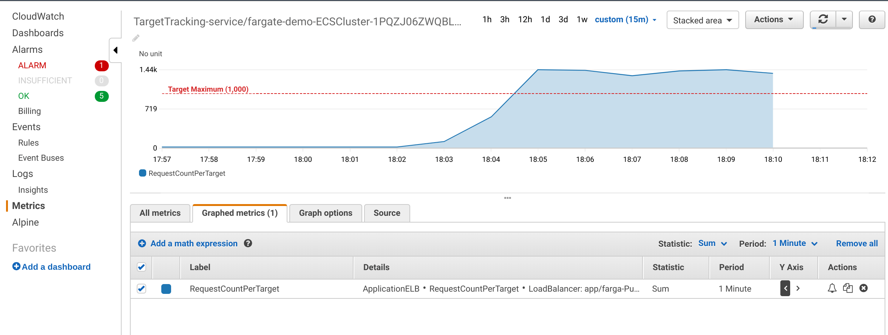
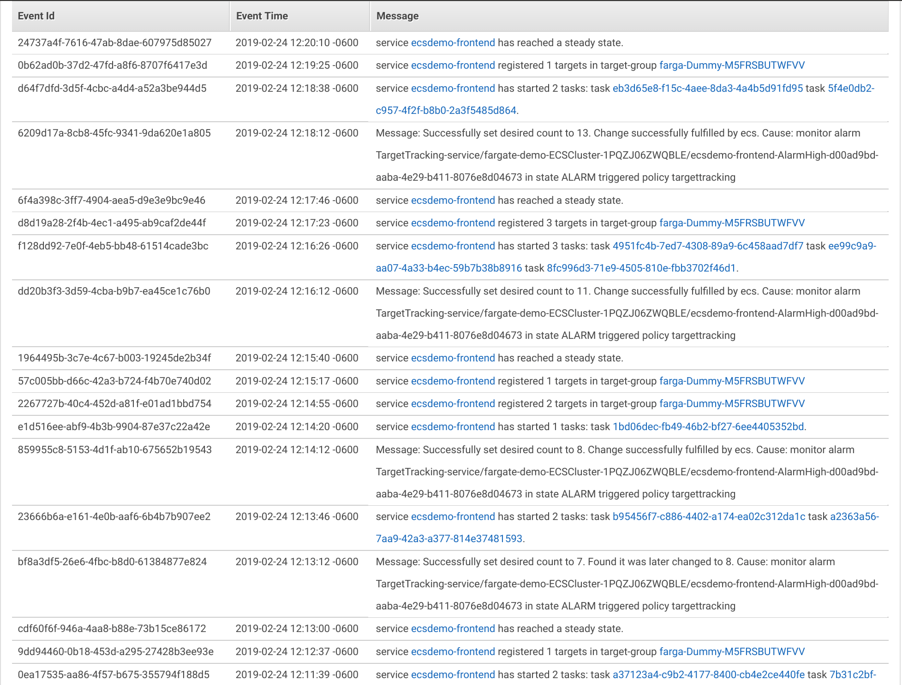
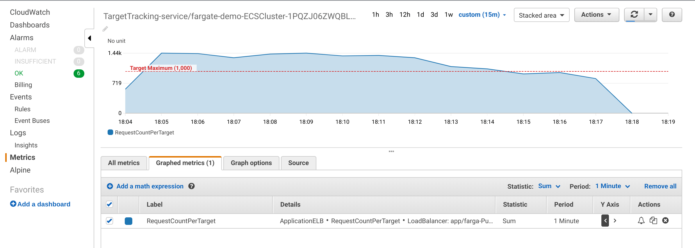
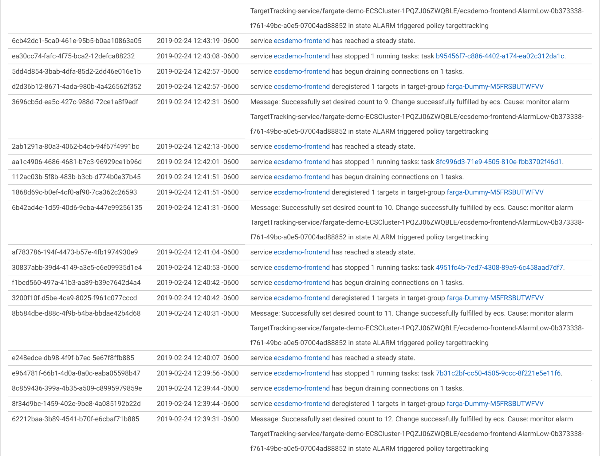

# Setup

Start with a cloud9 instance and deploy the frontend application from [ecsworkshop.com](https://ecsworkshop.com):

```
sudo curl -so /usr/local/bin/ecs-cli https://s3.amazonaws.com/amazon-ecs-cli/ecs-cli-linux-amd64-latest
sudo chmod +x /usr/local/bin/ecs-cli

sudo yum -y install jq gettext

export AWS_REGION=$(curl -s 169.254.169.254/latest/dynamic/instance-identity/document | jq -r .region)
echo "export AWS_REGION=${AWS_REGION}" >> ~/.bash_profile
aws configure set default.region ${AWS_REGION}
aws configure get default.region

cd ~/environment
git clone https://github.com/brentley/ecsdemo-frontend.git
git clone https://github.com/brentley/fargate-demo.git

aws iam get-role --role-name "AWSServiceRoleForElasticLoadBalancing" || aws iam create-service-linked-role --aws-service-name "elasticloadbalancing.amazonaws.com"

aws iam get-role --role-name "AWSServiceRoleForECS" || aws iam create-service-linked-role --aws-service-name "ecs.amazonaws.com"

cd ~/environment/fargate-demo

aws cloudformation deploy --stack-name fargate-demo --template-file cluster-fargate-private-vpc.yml --capabilities CAPABILITY_IAM

aws cloudformation deploy --stack-name fargate-demo-alb --template-file alb-external.yml

export clustername=$(aws cloudformation describe-stacks --stack-name fargate-demo --query 'Stacks[0].Outputs[?OutputKey==`ClusterName`].OutputValue' --output text)
export target_group_arn=$(aws cloudformation describe-stack-resources --stack-name fargate-demo-alb | jq -r '.[][] | select(.ResourceType=="AWS::ElasticLoadBalancingV2::TargetGroup").PhysicalResourceId')
export alb_arn=$(aws cloudformation describe-stack-resources --stack-name fargate-demo-alb | jq -r '.[][] | select(.ResourceType=="AWS::ElasticLoadBalancingV2::LoadBalancer").PhysicalResourceId')
export vpc=$(aws cloudformation describe-stacks --stack-name fargate-demo --query 'Stacks[0].Outputs[?OutputKey==`VpcId`].OutputValue' --output text)
export ecsTaskExecutionRole=$(aws cloudformation describe-stacks --stack-name fargate-demo --query 'Stacks[0].Outputs[?OutputKey==`ECSTaskExecutionRole`].OutputValue' --output text)
export subnet_1=$(aws cloudformation describe-stacks --stack-name fargate-demo --query 'Stacks[0].Outputs[?OutputKey==`PrivateSubnetOne`].OutputValue' --output text)
export subnet_2=$(aws cloudformation describe-stacks --stack-name fargate-demo --query 'Stacks[0].Outputs[?OutputKey==`PrivateSubnetTwo`].OutputValue' --output text)
export subnet_3=$(aws cloudformation describe-stacks --stack-name fargate-demo --query 'Stacks[0].Outputs[?OutputKey==`PrivateSubnetThree`].OutputValue' --output text)
export security_group=$(aws cloudformation describe-stacks --stack-name fargate-demo --query 'Stacks[0].Outputs[?OutputKey==`ContainerSecurityGroup`].OutputValue' --output text)
export alb_label=$(echo $alb_arn |grep -o 'farga-Publi.*')
export target_group_label=$(echo $target_group_arn |grep -o 'targetgroup.*')
export resource_label="app/$alb_label/$target_group_label"

cd ~/environment

ecs-cli configure --region $AWS_REGION --cluster $clustername --default-launch-type FARGATE --config-name fargate-demo
aws ec2 authorize-security-group-ingress --group-id "$security_group" --protocol tcp --port 3000 --cidr 0.0.0.0/0
cd ~/environment/ecsdemo-frontend
envsubst < ecs-params.yml.template >ecs-params.yml

ecs-cli compose --project-name ecsdemo-frontend service up \
    --create-log-groups \
    --target-group-arn $target_group_arn \
    --private-dns-namespace service \
    --enable-service-discovery \
    --container-name ecsdemo-frontend \
    --container-port 3000 \
    --cluster-config fargate-demo \
    --vpc $vpc
    
ecs-cli compose --project-name ecsdemo-frontend service scale 3 \
    --cluster-config fargate-demo
ecs-cli compose --project-name ecsdemo-frontend service ps \
    --cluster-config fargate-demo

alb_url=$(aws cloudformation describe-stacks --stack-name fargate-demo-alb --query 'Stacks[0].Outputs[?OutputKey==`ExternalUrl`].OutputValue' --output text)
echo "Open $alb_url in your browser"

```

# Set up Target Tracking Autoscaling:
```

cd ~/environment/fargate-demo

aws application-autoscaling register-scalable-target \
    --service-namespace ecs \
    --scalable-dimension ecs:service:DesiredCount \
    --resource-id service/${clustername}/ecsdemo-frontend \
    --min-capacity 3 \
    --max-capacity 25

envsubst <config.json.template >/tmp/config.json

aws application-autoscaling put-scaling-policy --cli-input-json file:///tmp/config.json

```


# test autoscaling by sending traffic:

First we start up a baseline of traffic:
```
while true; do curl -so /dev/null $alb_url ; sleep 1 ; done &                  

```
Our service is holding at the minimum level of 3 tasks.


# Scale Out
After establishing that baseline, we add some load:
```
while true; do ab -l -c 9 -t 60 $alb_url ; sleep 1; done
```
This command is Apache Bench. We generate 9 concurrent requests (`-c 9`), as 
rapidly as can be filled, for 60 seconds (`-t 60`), and ignore length variances (`-l`).
We loop this repeatedly, so we can see statistics every 60 seconds.

We see in the CloudWatch graph that traffic ramps up over the maximum threshold, 
and stays there, triggering an alarm status.



We see the scale out to meet the traffic increase:



Our CloudWatch graph now shows the traffic per target back down under the alarm threshold.



# Scale In
Scaling out works well. Let's see how scaling in works.

First, let's stop our traffic load. `Ctrl-C` the ab loop (twice to cancel the loop).

We take a more conservative approach to scaling in, not triggering any action until
traffic has been under the threshold for 15 consecutive minutes. After that, Autoscaling
will drain and stop one container at a time until we reach the per-target threshold, or
the minimum task count.


(continued)


If we look at our baseline request graph, we see that requests are much lower than our 
scaling threshold, but we maintain the minimum number of tasks, for redundancy.

Now let's check the request graph, and we see a spike in incoming requests, going above our scaling threshold. This triggers
an alarm, and a scale up of our service to meet the demand.

We continue to scale up until our requests per task falls below our established limit. 
(logs of ecs scaling events)

When traffic subsides, our service will begin to scale back down (slowly and conservatively)